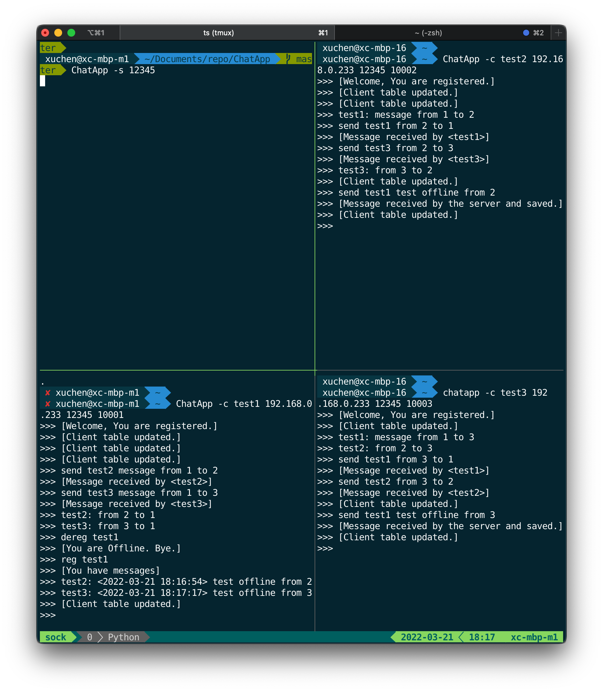
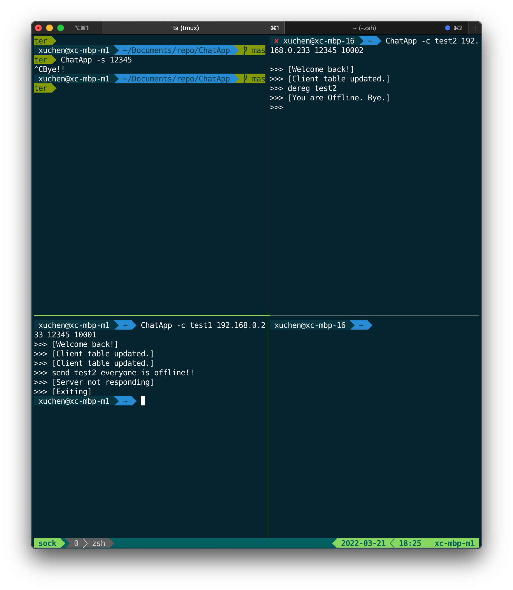
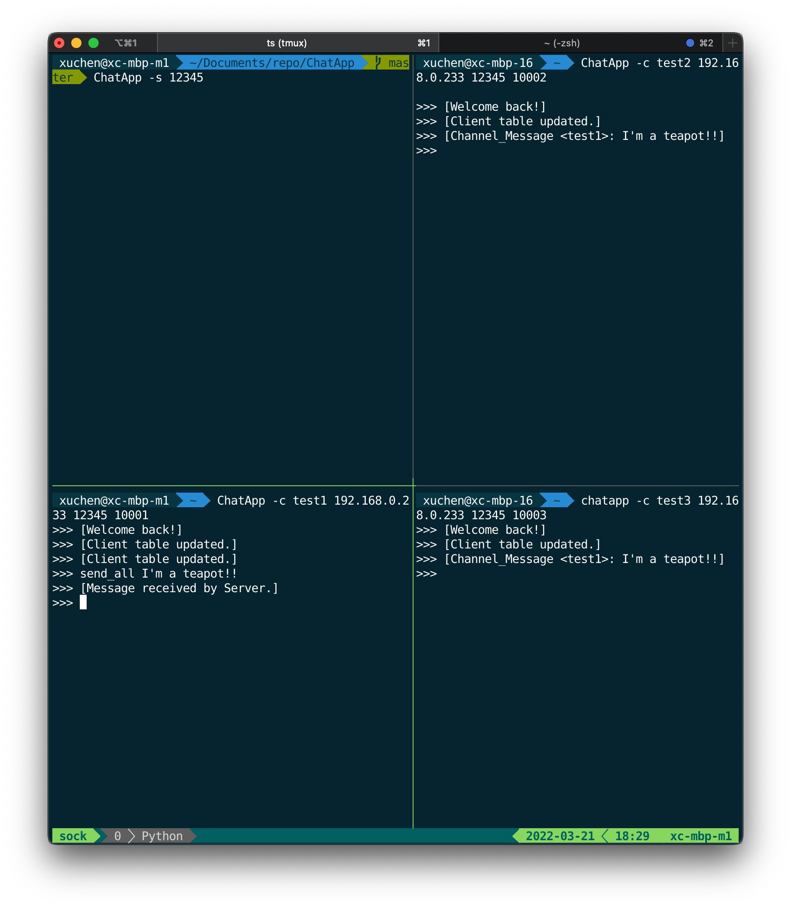

test
===

I did all of these three tests ___ON TWO COMPUTER IN A LOCAL NETWORK___, it makes no sense if the client and server share one table.

Some output may be a little bit different from the requirements, but these are ___BY DESIGN___, because I don't want to lose the user table everytime the server restarts and broadcast table when not necessary (see more in README.md).

If you want to get the same result as requirement, just clean the table by `make clean_user`, or simply login with another username for different tests.

All the dependencies are builtin packages of default python3 on ubuntu, and I did a few test on server, it should work fine.

test-case 1
===



1. start server

    server started

2. start client x(the table should be sent from server to x)

    client1 input: 
    ```
    $ ChatApp -c test1 192.168.0.233 12345 10001
    ```

    client1 output:
    ```
    >>> [Welcome, You are registered.]
    >>> [Client table updated.]
    ```

3. start client y(the table should be sent from server to x and y)

    client2 input:
    ```
    $ ChatApp -c test2 192.168.0.233 12345 10002
    ```

    client2 output:
    ```
    >>> [Welcome, You are registered.]
    >>> [Client table updated.]
    ```

    client1 output:
    ```
    >>> [Client table updated.]
    ```

4. start client z(the table should be sent from server to x and y and z)

    client3 input:
    ```
    $ ChatApp -c test3 192.168.0.233 12345 10003
    ```

    client3 output:
    ```
    >>> [Welcome, You are registered.]
    >>> [Client table updated.]
    ```

    client1 output:
    ```
    >>> [Client table updated.]
    ```

    client2 output:
    ```
    >>> [Client table updated.]
    ```

5. chat x -> y, y->z, ... , x ->z (All combinations)

    client1 input: 
    ```
    >>> send test2 meesage from 1 to 2
    ``` 

    client1 output:
    ```
    >>> [Message received by <test2>]
    ```

    client2 output:
    ```
    >>> test1: message from 1 to 2
    ```

    likewise...

6. dereg x (the table should be sent to y, z. x should receive ’ack’)

    client1 input:
    ```
    dereg test1
    ```

    client1 output:
    ```
    >>> [You are offline. Bye.]
    ```

    client 2&3 output:
    ```
    >>> [Client table updated.]
    ```

7. chat y->x (this should fail and message should be sent to server, and message has to be saved for x in the server)

    client2 input:
    ```
    >>> send test1 test offline from 2
    ```

    client2 output:
    ```
    >>> [Message received by server and saved]
    ```
8. chat z->x (same as above)

    client3 input:
    ```
    >>> send test1 test offline from 3
    ```

    client3 output:
    ```
    >>> [Message received by server and saved]
    ```

9.  reg x (messages should be sent from server to x, x’s status has to be broadcasted to all the other clients)

    client1 input:
    ```
    >>> reg test1
    ```

    client1 output:
    ```
    >>> [You have messages]
    >>> test2: <2022-03-21 18:16:54 test offline from 2>
    >>> test3: <2022-03-21 18:17:17 test offline from 3>
    >>> [Client table updated.]
    ```

    client 2&3 output:
    ```
    >>> [Client table updated.]
    ```
10. x, y, z:exit


test-case 2
===



1. start server

2. start client x (the table should be sent from server to x )

    client1 input:
    ```
    $ ChatApp -c test1 192.168.0.233 12345 10001

    ```

    client1 output:
    ```
    >>> [Welcome back!]
    >>> [Client table updated.]
    ```

    because we already have user "test1", so welcome message becomes "[welcome back!]"

3. start client y (the table should be sent from server to x and y)

    client2 input:
    ```
    $ ChatApp -c test2 192.168.0.233 12345 10002

    ```

    client2 output:
    ```
    >>> [Welcome back!]
    >>> [Client table updated.]
    ```

    client1 output:
    ```
    >>> [Client table updated.]
    ```

4. dereg y

    client2 input:
    ```
    >>> dereg test2
    ```

    client2 output:
    ```
    >>> [You are Offline. Bye.]
    ```

    client1 output:
    ```
    >>> [Client table updated.]
    ```

5. server exit

6. send message x-> y (will fail with both y and server, so should make 5 attempts and exit)

    client1 input:
    ```
    send test2 everyone is offline!!
    ```

    client1 output:
    ```
    >>> [Server not responding]
    >>> [Exiting]

    (program exit with code 0)
    ```

## test-case 3



1. start server
   
2. start client x (the table should be sent from server to x )

   client1 input:
   ```
   $ ChatApp -c test1 192.168.0.233 12345 10001
   ```

   client1 output:
   ```
   >>> [Welcome back!]
   ```

   no table sent to client 1 because client 1 leave silently in previous test-case2, so the status in table won't change after registration
   
   (if username is test4, server will send table to client1)


3. start client y (the table should be sent from server to x and y)

    client2 input:
    ```
    $ ChatApp -c test2 192.168.0.233 12345 10002
    ```

    client2 output:
    ```
    >>> [Welcome back!]
    >>> [Client table updated]
    ```

    client1 output:
    ```
    >>> [Client table updated]
    ```


4. start client z (the table should be sent from server to x , y and z) 

    client3 input:
    ```
    $ ChatApp -c test3 192.168.0.233 12345 10003
    ```

    client3 output:
    ```
    >>> [Welcome back!]
    >>> [Client table updated]
    ```

    client1 and client2 didn't update table because client3 left silently, and there is no change in client1 & client2's local table, so no need to update

    (again, if no previous test-cases are made, server should send all existing user update-table message)


5. send group message x-> y,z

    client1 input:
    ```
    >>> send_all I'm a teapot!!
    ```

    client1 output:
    ```
    >>> [Message received by Server.]
    ```

    client 2&3 output:
    ```
    >>> [Channel_Message <test1>: I'm a teapot!!]
    ```